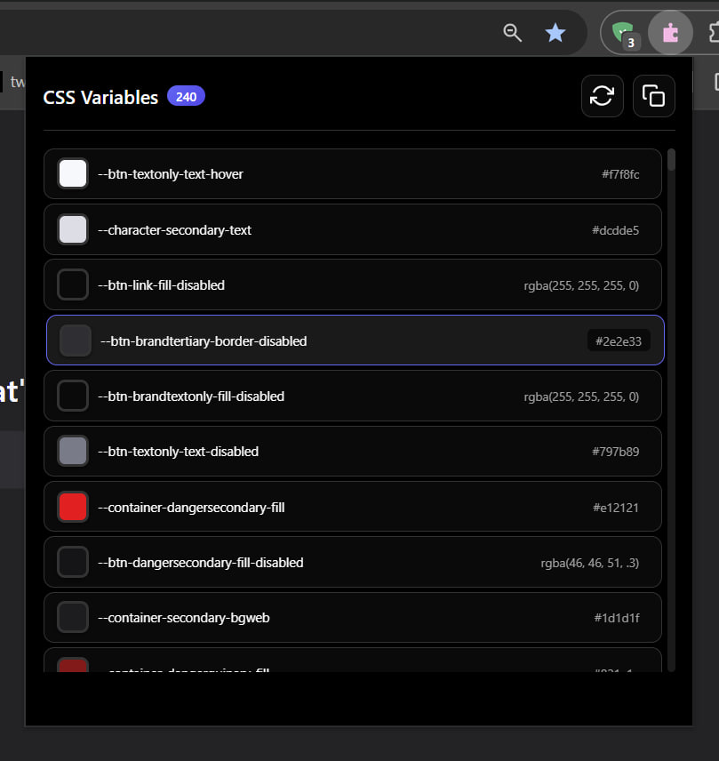

# CSS Variables Extractor — Chrome Extension

Розширення для Chrome, яке витягує всі CSS-змінні (custom properties) з поточної веб-сторінки.



## Можливості

- 🎨 **Екстракція CSS-змінних** — автоматично знаходить усі `--variable` з поточної сторінки
- 📋 **Копіювання** — копіювання всіх змінних або окремих значень
- 🔄 **Оновлення** — миттєве оновлення списку змінних
- 🎯 **Попередній перегляд кольорів** — візуальний попередній перегляд для кольорових значень
- 🌙 **Темна тема** — приємний інтерфейс у темних тонах

## Встановлення

### Розробка

```bash
# Встановити залежності
npm install

# Запустити dev-сервер
npm run dev
```

Після запуску:
1. Відкрий Chrome → `chrome://extensions/`
2. Увімкни **Developer mode**
3. Натисни **Load unpacked**
4. Обери папку `dist`

### Продакшн

```bash
npm run build
```

Зібране розширення буде у папці `release/` у вигляді ZIP-архіву.

## Як користуватися

1. Відкрий будь-який веб-сайт
2. Клікни на іконку розширення
3. Побачиш список усіх CSS-змінних зі сторінки
4. Клікни на змінну, щоб скопіювати її
5. Або натисни кнопку копіювання всіх змінних

## Структура проекту

```
tasks/
├── src/
│   ├── popup/           # Основне вікно розширення
│   │   ├── index.html
│   │   ├── main.js      # Логіка екстракції та UI
│   │   ├── counter.js   # Утиліта counter
│   │   └── style.css    # Стилі з CSS-змінними
│   ├── sidepanel/       # Side panel
│   │   ├── index.html
│   │   ├── main.js
│   │   ├── counter.js
│   │   └── style.css
│   └── content/         # Content script
│       └── main.js      # Скрипт для витягування змінних
├── public/
│   └── logo.png
├── manifest.config.js   # Manifest V3 конфігурація
├── vite.config.js       # Vite конфігурація
└── package.json
```

## Технології

- **Vite** — швидка збірка проекту
- **@crxjs/vite-plugin** — плагін для Chrome Extension
- **Manifest V3** — остання версія маніфесту Chrome
- **Vanilla JavaScript** — без фреймворків

## Дозволи

- `activeTab` — доступ до активної вкладки для зчитування CSS

## Ліцензія

MIT
